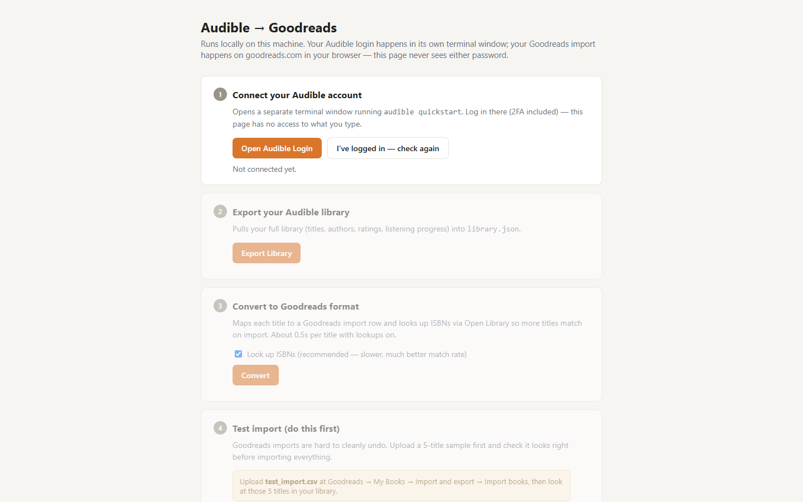

# Audible-To-GoodReads

Move your whole Audible library onto Goodreads in a few clicks: a local wizard exports your audiobooks, backfills ISBNs from Open Library and builds a CSV that Goodreads can import.

   



Try it: download the repository as a ZIP from [github.com/mindattic/Audible-To-GoodReads](https://github.com/mindattic/Audible-To-GoodReads), extract it, and double-click `Start.bat`.

There is no official integration between Audible and Goodreads (despite both being owned by Amazon), so this tool bridges the gap. It talks to Audible and reformats the data for Goodreads, but you log into both yourself: your passwords never touch this tool, only the real Audible and Goodreads login pages.

## Why

- Get hundreds of audiobooks onto your Goodreads shelves without adding them one at a time.
- Land each book on the right shelf: read, currently-reading or to-read comes from your actual Audible listening progress.
- Match more books on import, because each title is looked up on the free Open Library database for an ISBN.
- Try a 5-title test import first, so a bad bulk import never has to be cleaned up by hand.
- Start from nothing: `Start.bat` installs Python and every dependency for you, with no admin rights.
- Keep your credentials to yourself: the wizard never sees your Audible or Goodreads password.

## Features

- **Five-step local wizard** at `127.0.0.1:5151`. Each step unlocks after the previous one is done: connect Audible, export the library, convert, test import, full import.
- **Audible login in its own terminal.** Step 1 opens a separate window running `audible quickstart` (2FA works). The browser page cannot see what you type there.
- **Library export** through audible-cli into `library.json`: titles, authors, ratings and listening progress.
- **Goodreads CSV conversion** with the Goodreads import columns (Title, Author, ISBN, ISBN13, Exclusive Shelf, Date Added and the rest). Every row gets Binding `Audiobook`, the `audiobook` shelf, and the Audible ASIN in Private Notes.
- **ISBN backfill** from the Open Library search API, with a live progress bar and totals for ISBN matches and each shelf when it finishes.
- **Two downloads:** `test_import.csv` with the first 5 titles, and `goodreads_import.csv` with everything.
- **Standalone CLI.** The wizard is a thin wrapper around `audible_to_goodreads.py`, which runs on its own on Windows, macOS or Linux.

## Quick start

What you need:

- A Windows PC (this is what `Start.bat` targets; on macOS or Linux see Command line below)
- An internet connection
- Your Audible account login (2FA is fine)
- Your Goodreads account login
- Nothing else. You do not need Python, pip or any dev tools installed beforehand.

Steps:

1. **Get the files.** Download this repository as a ZIP (Code, then Download ZIP on GitHub) and extract it anywhere, for example your Desktop. If you cloned it with git, run `git pull` to bring it up to date.
2. **Double-click `Start.bat`.** A console window opens. On the first run only it checks for Python 3.10 or newer and installs Python 3.12 for your user account if it is missing (via `winget`, or the official python.org installer when `winget` is not available). It then installs Flask, requests and audible-cli. The first run can take a couple of minutes; later runs take a few seconds.
3. **Your browser opens automatically** to `http://127.0.0.1:5151`. This page exists only on your own computer; nothing is exposed to the internet. Work through the five steps top to bottom.
4. **When you are done,** close the browser tab and press any key in (or close) the console window to stop the app.

## Using the wizard

**Step 1, connect your Audible account.** Click **Open Audible Login**. A separate terminal window runs `audible quickstart`; log in there with your email, password and 2FA code. Then go back to the browser and click **I've logged in, check again**.

**Step 2, export your library.** Click **Export Library**. Your titles, authors, ratings and listening progress go into `library.json` in the project folder. This takes a few seconds.

**Step 3, convert to Goodreads format.** Click **Convert**. Leave **Look up ISBNs** checked (recommended): it queries Open Library for each title so Goodreads is far more likely to recognise the book. Lookups take about half a second per title, so a 250-book library takes roughly two minutes. When it finishes you see how many titles matched an ISBN and how many landed on each shelf.

**Step 4, test import.** Click **Download `test_import.csv`** (5 titles), then **Open Goodreads Import Page**. On Goodreads go to My Books, Import and export, Import books, and upload the file. Check those 5 titles in your Goodreads library before the full import; bulk imports are hard to undo cleanly.

**Step 5, full import.** Once the test batch looks right, click **Download `goodreads_import.csv`** and upload it on the same Goodreads page.

## How it works

```text
 Start.bat ──> bootstrap.ps1 ──> finds or installs Python 3.10+, pip installs requirements + audible-cli
                                  └─> python app.py  (Flask on 127.0.0.1:5151, opens the browser)

 browser wizard (static/index.html)
   1 Connect   POST /api/connect   ──> new terminal: audible quickstart   (your login, never seen by the app)
   2 Export    POST /api/export    ──> audible library export -f json -o library.json
   3 Convert   POST /api/convert   ──> audible_to_goodreads.convert()  ──> Open Library search API (ISBN)
               GET  /api/convert/progress   (polled for the progress bar)
   4 Test      GET  /download/test  ──> test_import.csv       (first 5 rows)
   5 Full      GET  /download/full  ──> goodreads_import.csv  (every row)
                                     ──> you upload it at goodreads.com/review/import
```

Shelf mapping, from `audible_to_goodreads.py`:

| Audible state | Goodreads Exclusive Shelf |
|---|---|
| `is_finished` true, or 100 percent complete | `read` (Date Read and Read Count 1 are filled in) |
| more than 0 percent complete | `currently-reading` |
| anything else | `to-read` |

## Command line

The wizard is a thin UI wrapper around a standalone CLI script. You can skip the browser entirely and run each step by hand; this also works on macOS and Linux, where `Start.bat` does not apply.

Step 1: install audible-cli.

```bash
pip install audible-cli
```

Step 2: authenticate with Audible (interactive, your credentials). Follow the prompts for the Amazon or Audible login, 2FA if enabled, and marketplace selection. This is needed once; it stores an auth profile locally.

```bash
audible quickstart
```

Step 3: export your library.

```bash
audible library export -f json -o library.json
```

Step 4: install this project's dependencies.

```bash
pip install -r requirements.txt
```

Step 5: convert to a Goodreads-ready CSV.

```bash
python audible_to_goodreads.py library.json -o goodreads_import.csv
```

This looks up each title on the free Open Library API to backfill ISBN and ISBN13 (most audiobooks do not carry one natively), which improves how well Goodreads matches each row to an existing book.

| Option | Default | What it does |
|---|---|---|
| `-o`, `--output` | `goodreads_import.csv` | Output CSV path |
| `--no-isbn-lookup` | off | Skip Open Library lookups for a faster, offline-only conversion with a lower match rate |
| `--delay` | `0.5` | Seconds to wait between Open Library requests |

Step 6: import into Goodreads: go to My Books, Import and export, Import books, and upload `goodreads_import.csv`. Test with a handful of rows first: copy the header plus a few rows into a separate file, upload that, check the results, then run the full import.

## Privacy

- `library.json`, `goodreads_import.csv` and `test_import.csv` (your actual book data) are created locally and excluded from the repository by `.gitignore`, so they never get committed or pushed.
- Your Audible login is stored locally by audible-cli in its own config directory (outside this project folder), the same as if you had run it yourself from a terminal.
- The tool makes exactly one kind of outbound call with your data: a title and author lookup per book to the public Open Library API, to find ISBNs. No other service sees your library.

## Troubleshooting

**A handful of titles did not import.** This is expected for some titles, especially self-published or Audible-exclusive audiobooks and audio dramas that never had a traditional ISBN; the Goodreads bulk importer cannot match them on title and author alone. Add those titles by hand with the normal Goodreads search box, which is more forgiving than the CSV importer. A very recent release can also fail even with a correct ISBN because Goodreads has not indexed it for import matching yet; try again in a week or two.

**Start.bat flashes and closes immediately.** Right-click `Start.bat` and choose Edit to confirm the download did not corrupt it, or run it once from inside a terminal (`cmd /c Start.bat`) to see the error before the window closes.

**"Python was not found" and the automatic install did not work.** Some locked-down or corporate machines block both `winget` and direct downloads. Install Python yourself from [python.org/downloads](https://www.python.org/downloads/), tick "Add python.exe to PATH" during setup, then run `Start.bat` again.

**The browser did not open, or shows nothing at 127.0.0.1:5151.** Another copy of the app may already be running, and only one can use the port at a time. Close the existing console window and try again, or open `http://127.0.0.1:5151` yourself while the console window is running.

**Audible login keeps failing or asks for 2FA repeatedly.** That happens in the separate `audible quickstart` window and is between you and Audible directly. Try again with a current 2FA code; they expire in about 30 seconds.

## Limitations

- Audible Originals, podcasts and some exclusives often have no ISBN anywhere. Those rows import with title and author only, and Goodreads either fuzzy-matches them, creates a new sparse book entry, or fails to import them.
- audible-cli uses a reverse-engineered private API. If Audible changes something, exports can break until audible-cli is updated.
- The Exclusive Shelf column comes from Audible's finished or in-progress state. Check that it looks right for a few titles before the full import.
- A correct ISBN does not guarantee a Goodreads match for very recent releases; the Goodreads catalog can lag behind.
- My Rating is always written as 0; Audible's rating goes into the Average Rating column.

## Project layout

| Path | What it is |
|---|---|
| `Start.bat` | Double-click launcher; runs `bootstrap.ps1` |
| `bootstrap.ps1` | Finds or installs Python 3.10+, installs dependencies, starts `app.py` |
| `app.py` | Flask app on `127.0.0.1:5151`: status, connect, export, convert, progress and download endpoints |
| `static/index.html` | The five-step wizard page |
| `audible_to_goodreads.py` | Standalone converter: library JSON in, Goodreads CSV out |
| `requirements.txt` | `requests`, `flask` (audible-cli is installed separately) |

## Documentation

- [AGENTS.md](AGENTS.md): entry point for AI agents working in this repo; it points at the shared MindAttic agent standard.

## License

This repository has no LICENSE file; all rights are reserved.

Part of [MindAttic](https://mindattic.com) — see more projects at [github.com/mindattic](https://github.com/mindattic). Related: [JellyFinPoster](https://github.com/mindattic/JellyFinPoster), another self-installing Python tool for your media library.
